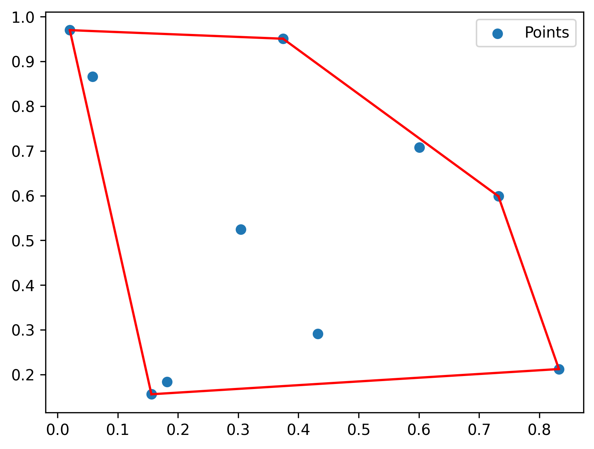

# NegMDF

🔍 **NegMDF** is a metabologenomics workflow that integrates mass defect filtering (MDF) with bioinformatic structural prediction and targeted MS/MS analysis, enabling the rapid discovery and identification of type I polyketides (T1PKs) from microbial sources, particularly under negative ionization mode. The method is described in detail in the [referenced paper](https://doi.org/10.1039/D4SC04174G).


## How to use

### Create conda environment 

```bash
conda create -n negmdf python=3.10
conda activate negmdf
conda install pandas numpy scipy shapely
```


### Prepare input csv files

- Ion list of the target strain culture in a csv file


- NegMDF window in a csv file


- If you want to convert an MZmine output quant table to an ion list for NegMDF, use this command:

```bash
python3 mzmine2ionlist.py -i data/MZmine_Features_iimn_gnps_quant.csv -o data/ion_list.csv
```


### Screen single or multiple ion lists using NegMDF

- For single mode

```bah
python3 negmdf_screen.py single -i data/ion_list.csv -w data/NegMDF_window.csv -o data/ion_list_screened.csv
```

- For multiple mode

Note: Place all your ion lists in a folder as input. The output must also be specified as a folder path in multiple mode.

```bash
python3 negmdf_screen.py multiple -i data/ion_lists -w data/NegMDF_window.csv -o data/output
```


## Notes

The so-called **MDF window** is essentially a **convex hull** constructed from points, which are derived through calculations based on predicted varient structures, in the mass defect plot (MDP).

A **convex hull** is the smallest convex shape (polygon or polyhedron) that encloses a given set of points in a plane or higher-dimensional space, as illustrated in the simple example below.



## Reference

The code in this repository is implemented with reference to the following paper.

```latex
@article{Liu2024,
  title = {A metabologenomics strategy for rapid discovery of polyketides derived from modular polyketide synthases},
  ISSN = {2041-6539},
  url = {http://dx.doi.org/10.1039/D4SC04174G},
  DOI = {10.1039/d4sc04174g},
  journal = {Chemical Science},
  publisher = {Royal Society of Chemistry (RSC)},
  author = {Liu,  Run-Zhou and Zhang,  Zhihan and Li,  Min and Zhang,  Lihan},
  year = {2024}
}
```

